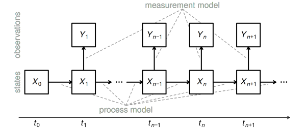
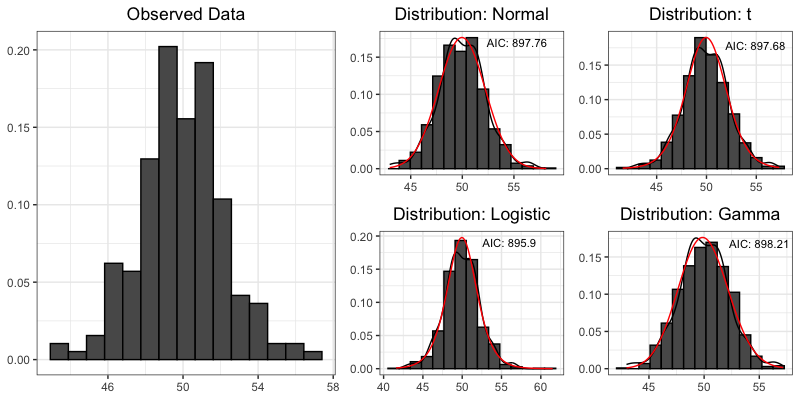

```{r setup, include=FALSE}
library(tidyverse)
library(haitipkg)
library(DiagrammeR)

myround <- function (x, digits = 1) {
  # taken from the broman package
  if (digits < 1)
    stop("This is intended for the case digits >= 1.")
  if (length(digits) > 1) {
    digits <- digits[1]
    warning("Using only digits[1]")
  }
  tmp <- sprintf(paste("%.", digits, "f", sep = ""), x)
  zero <- paste0("0.", paste(rep("0", digits), collapse = ""))
  tmp[tmp == paste0("-", zero)] <- zero
  tmp
}

dep_labeller <- as_labeller(
  c(
    'Artibonite' = 'Artibonite',
    'Sud_Est' = 'Sud-Est',
    'Sud.Est' = 'Sud-Est',
    'Nippes' = 'Nippes',
    'Nord_Est' = 'Nord-Est',
    'Nord.Est' = 'Nord-Est',
    'Ouest' = 'Ouest',
    'Centre' = 'Centre',
    'Nord' = 'Nord',
    'Sud' = 'Sud',
    'Nord_Ouest' = 'Nord-Ouest',
    'Nord.Ouest' = 'Nord-Ouest',
    'Grande_Anse' = 'Grand\'Anse',
    'Grand.Anse' = 'Grand\'Anse'
  )
)

theme_set(theme_bw())

knitr::opts_chunk$set(
  echo = FALSE,
  fig.height = 3, 
  fig.width = 4.75,
  message = FALSE
)
```

## Introduction

-   Nonlinear-dynamic statistical models have proven to be a useful tool for modeling infectious disease outbreaks.
-   Most common examples are SIR models and their various extensions.
-   Despite their utility, there exist many cautionary warnings against the use of these types of models (weakly identifiable, models may not be realistic, can have poor predictions, etc.) [@behrend20; @saltelli20; @ioannidis20; @ganusov16].
-   Current standards for model based inference do not adequately address these valid concerns.

## Topics

We try to address common shortcomings in non-linear dynamic modeling for policy inference, and offer practical advise on the use of mechanistic models for policy advice. Topics we consider include:

-   Fitting meta-population models.
-   Model evaluation via *benchmarks*.
-   Reproducibility and *Extendability*.

We begin by providing a brief description of the class of models being considered and the methods used to calibrate the models to observed incidence counts.

## Partially Observed Markov Processes

-   The models we focus on are partially observed Markov process (POMP) models.

{width="70%"}

## POMP Models

1.  Parameter vector $\theta$ that indexes the model
2.  One step transition density: $f_{X_n|X_{n - 1}}(x_n|x_{n -1};\theta)$.
3.  Measurement Model: $f_{Y_{n}|X_n}(y_n|x_n; \theta)$.
4.  Initial density: $f_{X_0}(x_0;\theta)$

We limit ourselves to the case when we can only simulate from (2), called the *simulation based* or *plug-and-play* property.

This framework allows us to consider arbitrary dynamic models; our limitations are our scientific creativity and the information available in the data.

## Cholera in Haiti

As a case study, we consider the 2010-2019 cholera outbreak in Haiti.

-   Cholera was introduced to Haiti in 2010 following the devastating earthquake of the same year.
-   Although some new cases have been detected, there were no recorded cholera cases in Haiti between February, 2019 and September 2022 @trevisin22.

We did a literature review on PubMed for key words: "Haiti", "cholera", and "model", resulting in 66 papers.

-   These papers include fitting models "by-hand", relying on previous estimates of model parameters, or by using Bayesian or Frequentist methods.

## Data

```{r prepData, include=FALSE, echo=FALSE, message=FALSE}
plot_df <- haitiCholera %>%
  select(-report) %>%
  mutate(date = as.Date(date_saturday)) %>%
  select(-date_saturday) %>%
  pivot_longer(
    data = .,
    cols = -c(date),
    names_to = 'Departement',
    values_to = "Cases",
  )
```

```{r plotNationalData, cache=TRUE}
true_agg_cases <- haitiCholera %>%
  select(-report) %>%
  pivot_longer(
    data = .,
    cols = -date_saturday,
    values_to = 'cases',
    names_to = 'dep'
  ) %>%
  mutate(
    date = as.Date(date_saturday),
    dep = gsub("\\.", "_", dep)
  ) %>%
  mutate(
    dep = case_when(dep == "Grand_Anse" ~ "Grande_Anse", TRUE ~ dep)
  ) %>%
  tidyr::pivot_wider(
    data = .,
    id_cols = c(date),
    names_from = dep,
    values_from = cases,
    names_prefix = 'cases_'
  ) %>%
  mutate(
    ReportedAll = cases_Artibonite + cases_Centre +
      cases_Grande_Anse + cases_Nippes + cases_Nord +
      cases_Nord_Est + cases_Ouest + cases_Sud +
      cases_Sud_Est + cases_Nord_Ouest
  )

ggplot(true_agg_cases, aes(x = date, y = ReportedAll)) + 
  geom_line() + 
  theme(axis.title.x = element_blank()) + 
  ylab("Reported Cases") +
  scale_y_log10(
    labels = scales::trans_format("log10", scales::math_format(10^.x))
  ) + 
  scale_x_date(date_labels = "%Y", breaks = seq.Date(from = as.Date("2011-01-01"), as.Date("2019-01-01"), by = '1 years'))
```

## Department Specific Data

```{r PlotData, cache=TRUE}
ggplot(plot_df, aes(x = date, y = Cases + 1)) +
  facet_wrap(~Departement, nrow = 2, labeller = dep_labeller) +
  geom_line() +
  theme(
    axis.title.x = element_blank(),
    axis.text.x = element_text(size = 8)
  ) +
  ylab('Reported Cases') +
  scale_y_log10(labels = scales::trans_format("log10", scales::math_format(10^.x))) +
  scale_x_date(date_labels = "'%y", breaks = seq.Date(from = as.Date("2011-01-01"), as.Date("2019-01-01"), by = '2 years'))
```

```{r cleanPlotDf, include=FALSE, message=FALSE, echo=FALSE}
rm(plot_df)
gc()
```

## Models

-   We build on the study by Lee et. al (2020), in which expert teams independently built non-linear models to describe cholera dynamics.

|                | Model 1        | Model 2             | Model 3               |
|-----------------|-----------------|---------------------|-----------------|
| Type           | Stochastic     | Deterministic       | Stochastic            |
| Spatial Model  | No             | Yes                 | Yes                   |
| Structure      | SEIAR          | SEIARW              | SIARW                 |
| Fitting Method | IF2 @ionides15 | Trajectory Matching | IF2 / IBPF @ionides22 |

-   The inability of the original models to predict the long absence of cases (2019-2022) has led to some discussion [@francois20; @rebaudetComment20; @henrys20; @leeReply20].

# Model Fitting

## Models 1 and 2

-   Model 2 is deterministic and consequently the easiest to fit. We mimic the original efforts of Lee et al. and fit the model using trajectory matching using the `spatPomp` package in `R`.
-   Model 1 is stochastic, spatially aggregated. We used the iterated filtering method to estimate model parameters @ionides15.
-   Iterated filtering (IF2) was originally used to fit Model 3 @lee20, which is both stochastic and has a meta-population structure.

## Model 3

-   IF2 is based on particle filters @arulampalam02 and scales poorly to meta-population models.
-   Rebeschini and Van Handel @rebeschini15 proposed the block particle filter (BPF) and provided some theoretical support for many scenarios.
-   Recently developed iterated block particle filters (IBPF) @ionides22 build on the BPF algorithm and it has similar theoretical properties @ning21ibpf.
-   We use the IBPF to fit Model 3 to the spatially explicit department data, resulting in better qualitative and quantitative model fits.

## Common workflow

-   In our literature review of papers that model cholera in Haiti, nearly all papers had a workflow similar to the following:
    -   Propose one (or more) models for the disease system
    -   Calibrate model parameters and pick final model based on some criteria (visually, posterior predictive checks, AIC, etc.)
    -   Use final model to make inference on the system and make policy suggestions.
-   Missing from this common workflow are comparisons to models outside of the paper and quantitative descriptions on the goodness-of-fit.
-   The primary form of model validation is often visual comparisons to observed data.

## Example: Common Workflow

```{r distExamp, warning=FALSE}
library(arima2)

my_theme <- theme_bw() + theme(plot.title = element_text(hjust = 0.5), axis.title = element_blank())

set.seed(272116)

intercept <- 50
coefs <- sample_ARMA_coef(order = c(2, 1))

x <- arima.sim(model = list(ar = c(coefs[1], coefs[2]), ma = coefs[3]), n = 200) + intercept

df <- data.frame(
  times = 1:200, 
  var = as.numeric(x)
)

gg_dat <- ggplot(df, aes(var)) +
  geom_histogram(bins = 15, col = 'black', aes(y = ..density..)) +
  theme_bw() + 
  ggtitle("Observed Data") + 
  my_theme 
  
library(MASS)

tdist <- fitdistr(x, 't')
norm <- fitdistr(x, 'normal')
cauchy <- fitdistr(x, 'cauchy')
gamma <- fitdistr(x, 'gamma')
logistic <- fitdistr(x, 'logistic')

aic_norm <- -2 * norm$loglik + 2 * length(norm$estimate)
aic_t <- -2 * tdist$loglik + 2 * length(tdist$estimate)
aic_cauchy <- -2 * cauchy$loglik + 2 * length(cauchy$estimate)
aic_gamma <- -2 * gamma$loglik + 2 * length(gamma$estimate)
aic_logistic <- -2 * logistic$loglik + 2 * length(logistic$estimate)

norm_sims <- data.frame(
  obs = 1:1000,
  var = rnorm(n = 1000, mean = norm$estimate['mean'], sd = norm$estimate['sd'])
)

t_sims <- data.frame(
  obs = 1:1000, 
  var = tdist$estimate['s'] * rt(n = 1000, df = tdist$estimate['df']) + tdist$estimate['m']
)

gamma_sims <- data.frame(
  obs = 1:1000, 
  var = rgamma(n = 1000, shape = gamma$estimate['shape'], rate = gamma$estimate['rate'])
)

logistic_sims <- data.frame(
  obs = 1:1000, 
  var = rlogis(n = 1000, location = logistic$estimate['location'], scale = logistic$estimate['scale'])
)

gg_norm <- ggplot() + 
  geom_histogram(data = norm_sims, aes(x = var, y = ..density..), col = 'black', bins = 15) + 
  geom_density(data = df, aes(x = var)) + 
  stat_function(
    fun = dnorm,
    args = list(mean = norm$estimate['mean'], sd = norm$estimate['sd']),
    col = 'red'
  ) + 
  ggtitle('Distribution: Normal') + 
  annotate(geom = 'text', x = 55.3, y = 0.17, label = paste0("AIC: ", round(aic_norm, 2)), size = 3) + 
  my_theme

mydt <- function(x, m, s, df, log) exp(dt((x - m)/s, df, log = TRUE) - 
  log(s))

gg_t <- ggplot() + 
  geom_histogram(data = t_sims, aes(x = var, y = ..density..), col = 'black', bins = 15) + 
  geom_density(data = df, aes(x = var)) + 
  stat_function(
    fun = mydt,
    args = list(m = tdist$estimate['m'], s = tdist$estimate['s'], df = tdist$estimate['df'], log = TRUE),
    col = 'red'
  ) + 
  annotate(geom = 'text', x = 54.91, y = 0.178, label = paste0("AIC: ", round(aic_t, 2)), size = 3) + 
  my_theme + 
  ggtitle("Distribution: t")

gg_log <- ggplot() + 
  geom_histogram(data = logistic_sims, aes(x = var, y = ..density..), col = 'black', bins = 15) + 
  geom_density(data = df, aes(x = var)) + 
  stat_function(
    fun = dlogis,
    args = list(location = logistic$estimate['location'], scale = logistic$estimate['scale']),
    col = 'red'
  ) + 
  annotate(geom = 'text', x = 56, y = 0.191, label = paste0("AIC: ", round(aic_logistic, 2)), size = 3) + 
  my_theme + 
  ggtitle("Distribution: Logistic")

gg_gam <- ggplot() + 
  geom_histogram(data = gamma_sims, aes(x = var, y = ..density..), col = 'black', bins = 15) + 
  geom_density(data = df, aes(x = var)) + 
  stat_function(
    fun = dgamma,
    args = list(shape = gamma$estimate['shape'], rate = gamma$estimate['rate']),
    col = 'red'
  ) + 
  annotate(geom = 'text', x = 55, y = 0.168, label = paste0("AIC: ", round(aic_gamma, 2)),
           size = 3) + 
  my_theme + 
  ggtitle("Distribution: Gamma")

# TO CREATE AND SAVE THE FIGURE: 
# library(gridExtra)
# 
# lay <- rbind(
#   c(1, 1, 1, 2, 2, 3, 3),
#   c(1, 1, 1, 4, 4, 5, 5)
# )
# 
# grid.arrange(
#   gg_dat, gg_norm, gg_t, gg_log, gg_gam,
#   layout_matrix = lay
# )
```



## Example: Common Workflow

Using the common workflow, we may pick the Logistic model as a valid description of our data and use this model to make inference on the data.

Unfortunately, none of the proposed models are a good description of the data, and each provides a relatively week prediction of future observations.

Each model is missing an important feature of the data: time dependence between observations.

## Example: Continued...

An ARMA(1, 0) model has AIC value `r round(arima2::arima(df$var, order = c(1, 0, 0))$aic, 2)` (compared to the AIC of the logistic model: 895.5).

```{r fig.align='center', fig.width=4, crop=NULL}
plot(x, xlab = "", ylab = '')
```

## Model Evaluation

-   Model assessment turns out to be a challenging problem in its own right.

-   Stochastic simulations from the generating model may not necessarily look like the training data.

-   Cross-validation isn't really an option.

-   People are thinking about this: Bayesian approach by Aristotelous, Kypraios and O'Neill @aristotelous22.

## Benchmarking

-   Comparisons across models only informs us about the relative goodness-of-fit of each model.

-   Visual comparisons can be misleading and cross-validation is not a viable approach to validating dynamic models.

-   To calibrate relative measures of fit, it is useful to compare against a model with a well-understood statistical ability to fit to data. We call such a model a *benchmark*. In other areas, this could include linear / logistic regression or even an iid model.

-   A log-linear Gaussian ARMA model makes a good benchmark for epidemiological models @he10.

-   We compare to a log-ARMA model using log-likelihoods due to its statistical properties.

## Benchmarking (continued...)

Some additional considerations for benchmarking:

-   Not every model needs to beat a benchmark: suitable benchmarks are typically designed to maximize their predictive ability, whereas POMP models provide a valuable mechanistic description of the system in question.
-   Benchmarks can be beneficial when developing models at differing spatial scales (where direct comparison between models is meaningless) by comparing models to their respective benchmarks and assessing their respective advantages and shortcomings.

```{=tex}
\begin{center}
\begin{tabular}{|l|rc|rc|rc|}
\hline
& Model~1& (p) & Model~2 & (p) & Model~3 & (p)
\\
\hline
Wheeler et al
& \cellcolor{yellow!50} -2731.3 & \cellcolor{yellow!50}(15)
& -21957.3 & (6)
& \cellcolor{yellow!50} -17850.4 & \cellcolor{yellow!50}(35)
\\
Lee et al
& -3030.9 & (20)
& -29367.4 & (6)
& -31840.8 & (29)
\\
Log-ARMA(2,1) \hspace{-2.5mm}
& -2803.7 & (4)  %% -0.5*5615.3+4
& \cellcolor{yellow!50} { -18027.0} & \cellcolor{yellow!50} (40)  %% -0.5*36133.9+40
& -18027.0 & (40)
\\
\hline
\end{tabular}
\end{center}
```
<!-- ## Meta-Population Models  -->

<!-- Using a spatially explicit model rather than aggregating over spatial units is a double edged: -->

<!-- -   Evidence for spatially explicit models has been given @king15, including the specific need to model heterogeneity between cholera transmission across Haitian departments @collins14. -->

<!-- -   Simple models may be preferred over more complex models [@saltelli20; @green15].  -->

<!-- Methods based on sequential Monte Carlo (SMC) suffer from the curse of dimensionality, rendering inference for meta-population models difficult or impossible (TODO: CITE). -->

<!-- # Model Fitting -->

<!-- ## Nested Models -->

<!-- -   Non-linear dynamic models make assumptions about the dynamics of the system in question. -->

<!-- -   Consider testing scientifically meaningful nested hypothesis. -->

<!-- -   For example, we consider adding a linear trend in transmission to Model 1 in order to account for the apparent decrease in cholera cases. -->

<!-- ## Example: Model 1 -->

<!--  -->

<!-- ## Model 1 (Continued...) -->

<!-- -   Individuals move $S \rightarrow E$ at time $t$ with a rate of $\lambda(t)$, where: -->

<!-- $$ -->

<!-- \lambda(t) = (I + \epsilon A)^\nu \color{red}{\frac{d\Gamma(t)}{dt}} \color{black}{\beta(t)/N}, -->

<!-- $$  -->

<!-- $$ -->

<!-- \log \beta(t) = \sum_{j = 1}^6\beta_js_j(t) + \color{red}{\xi \bar{t}} -->

<!-- $$ -->

<!-- -   $\frac{d\Gamma}{dt}$ is multiplicative Gamma white-process noise, $\epsilon, \nu, \xi, \beta_{1:6}$ are parameters to be estimated, $s_{1:6}(t)$ are a B-spline basis. -->

<!-- ## Testing a linear trend -->

<!-- -   We test for a linear trend in transmission using a 95% Monte Carlo adjust profile confidence interval (MCAP-CI) (TODO: Cite). -->

<!-- -   The test suggests a marginally significant negative linear trend in transmission, with confidence interval $\xi \in (-0.085, -0.005)$. -->

<!-- {width="68%"} -->

<!-- ## Model Forecasts -->

<!-- -   One of the primary reasons dynamic models are fit to data is to obtain forecasts of the future state of the system. -->

<!-- -   When done carefully, forecasts can be helpful in informing policy and may enable real-time testing of new scientific hypothesis @lewis22. -->

<!-- ## Using Real-time data on the system -->

<!-- -   Recent information about a dynamic system should be more relevant for a forecast than older information. -->

<!-- -   While the previous statement seems self-evident, it is not the case for deterministic models which depend only on initial conditions, and is often not done in practice. -->

<!-- -   Let $X_{0:N}$ and $Y_{1:N}$ be random vectors denoting the latent and observed states from times $t_0, t_1, \ldots, t_N$, and let $y_{1:N}^*$ be the observed data that we use to fit a model. -->

<!-- -   Forecasts for future times $t_{N+1}, \ldots, t_{N+s}$ should be based on draws from $f_{Y_{N+1:N+S}|Y_{1:N} = y_{1:N}^*}(Y_{N+1:N+S}|Y_{1:N} = y_{1:N}^*; \hat{\theta})$, which can be done simulating starting from hidden states drawn from the filtering distribution at time $t_N$. -->

<!-- ## Accounting for All Uncertainty -->

<!-- -   Deterministic models are useful for obtaining estimates of general trends of the system but can lead to over-confidence in model forecasts (TODO: Cite kings paper). -->

<!-- -   Stochastic models account can include randomness in both the process and measurement models (TODO: Cite ionides paper on this) -->

<!-- -   It is important to also account for uncertainty in parameter estimates, as uncertainty in just a single parameter can lead to drastically different forecasts @saltelli20. -->

<!-- # Reproducibility -->

## Reproducibility and Extendability

-   In statistics, this often means setting a random seed and providing your data and code along with your submission.
-   Large projects, however, may make code hard to read or difficult for someone else to run.
-   A higher standard of reproducibility is that someone who was not directly involved in your initial project should be able to run and understand your code with limited effort.
-   *Extendability* is the idea that it should not be excessively burdensome for someone else to try a small modification to your analysis (such as a model modification or a change to a figure).
-   Scientific results are only trustworthy to the extent that they can be critically questioned, and an extendable analysis should facilitate such examination @gentleman07.

## Tools

-   The use of *dynamic documents*, like `Sweave` or `knitr`, which allow for the integration of \LaTeX and the code used to generate results.

-   Virtual environments can be used so that the same version of `R` / `Python` and each of the packages used during the analysis can be loaded and used at a later date.

-   `R` packages and `Python` libraries can also be built in the context of a data analysis project. This can be useful even if the only purpose of the package is for the problem at hand, since the package can contain data, code, and documentation.

## Additional Topics

-   Parameter estimates and hidden states should make sense in the context of the model and alternative measurements.

-   Conditional log-likelihoods are useful for determining weaknesses in the model.

-   Accounting for parameter uncertainty in model forecasts.

-   Accounting for most recent information in our forecasts.

-   Models are weakly identifiable.

## Acknowledgements

-   Lee et al.

-   Undergrads: Kevin Tan and Noah Truetle

-   Other grad students: AnnaElaine Rosengart, Zhuoxun Jiang

## References {.allowframebreaks}
